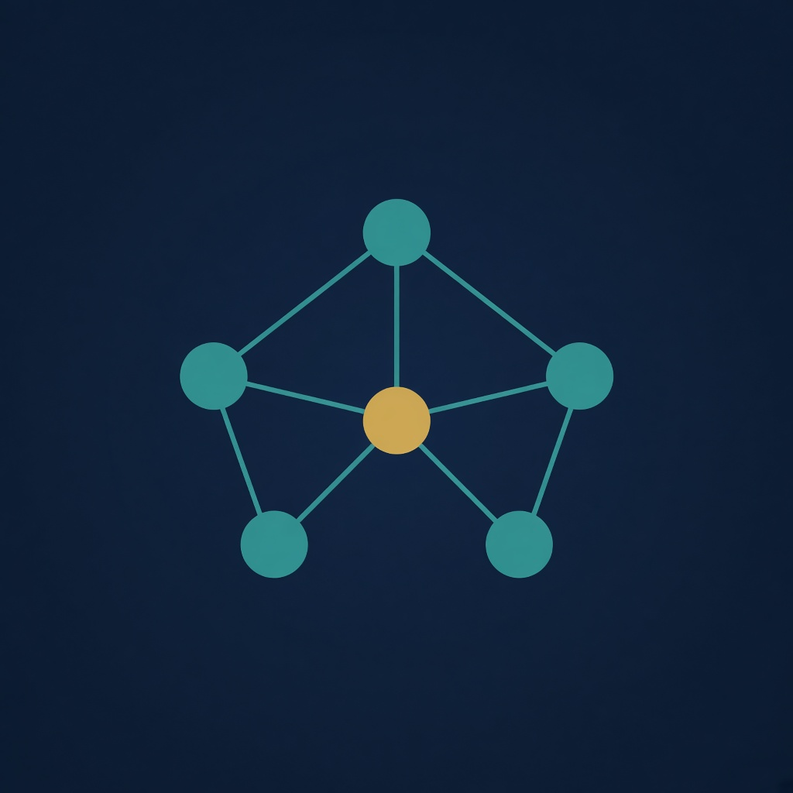
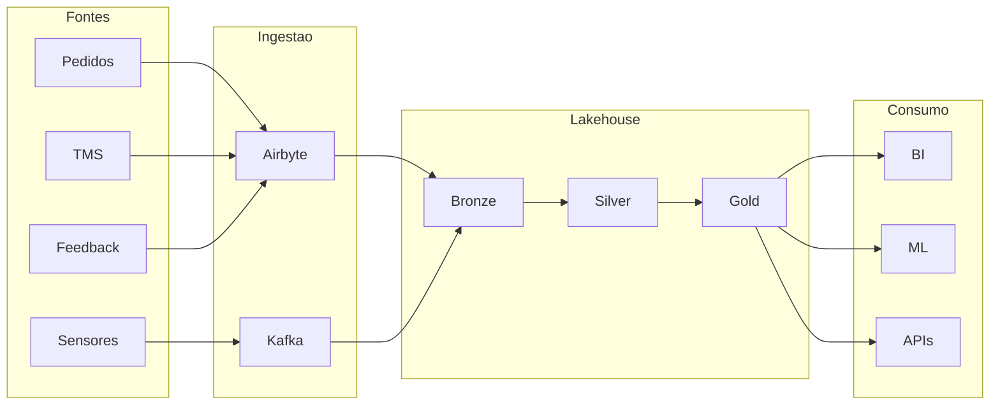

<br />
<div align="center">
  <a href="https://github.com/lucas-sva/logistream-platform">
    
  </a>

<h3 align="center">LogiStream Platform</h3>

  <p align="center">
    Lakehouse para previsão de demanda e otimização de rotas
    <br />
    <a href="docs/solucao.md"><strong>Explore a documentação</strong></a>
    <br />
    <br />
  </p>
</div>

## Sobre o projeto

A **LogiStream Platform** é a proposta de engenharia de dados da LogiStream Solutions, um varejo online que precisa integrar pedidos, logística, feedback de clientes e sensores de CD e frota para prever demanda e otimizar rotas.

O briefing pede a descrição da solução, com justificativa, ferramentas, tempo, benefícios e desafios. Este repositório entrega esse texto e, junto dele, os contratos, o IaC, os jobs e uma demo local que materializam a proposta.

A leitura completa está em [`docs/solucao.md`](docs/solucao.md).

## Arquitetura e design técnico

A plataforma é um lakehouse medalhão (Bronze, Silver, Gold) no Databricks sobre S3, com ingestão híbrida. Pedidos, TMS e feedback entram em lote via Airbyte. Sensores entram em streaming via Apache Kafka (Amazon MSK). PySpark conforma o Silver. dbt publica o Gold dimensional e as feature tables que o BI e o ML da empresa já esperam consumir.



Decisões e o modelo estrela: [`docs/adr/`](docs/adr/), [`docs/modelo-dimensional.md`](docs/modelo-dimensional.md), [`docs/governanca.md`](docs/governanca.md).

Produção é AWS + Databricks, descrita em Terraform. A demo local troca S3 por MinIO, MSK por Kafka em Docker e o warehouse Gold por PostgreSQL.

### Estrutura da solução

```plaintext
infra/terraform/     Landing zone AWS (VPC, S3, IAM, MSK) e Unity Catalog
ingest/airbyte/      Conexões batch de produção
ingest/local/        Loader Bronze da demo
stream/              Tópicos Kafka e producer de sensores
spark/jobs/          Bronze, Silver e Structured Streaming
transform/dbt/       Staging, marts de demanda e rotas, testes
data/contracts/      JSON Schema das quatro fontes
data/generator/      Dados sintéticos
compose/             Kafka, MinIO e PostgreSQL
docs/                Proposta, ADRs, modelo e governança
```

### Built With

* [![AWS][aws-shield]][aws-url]
* [![Databricks][databricks-shield]][databricks-url]
* [![Terraform][terraform-shield]][terraform-url]
* [![Apache Kafka][kafka-shield]][kafka-url]
* [![Apache Spark][spark-shield]][spark-url]
* [![Airbyte][airbyte-shield]][airbyte-url]
* [![dbt][dbt-shield]][dbt-url]
* [![Python][python-shield]][python-url]
* [![Docker][docker-shield]][docker-url]
* [![GitHub Actions][gha-shield]][gha-url]

## Como começar

A proposta em `docs/solucao.md` e o entregável do curso. Os passos abaixo sobem a demo local. Terraform de produção não precisa ser aplicado.

### Pré-requisitos

* **Docker Desktop**
* **Python 3.11+**

### Instalação

1. Clone o repositório:
   ```sh
   git clone https://github.com/lucas-sva/logistream-platform.git
   cd logistream-platform
   ```

2. Instale as dependências de desenvolvimento:
   ```sh
   pip install -r requirements-dev.txt
   ```

3. Suba Kafka, MinIO e PostgreSQL:
   ```sh
   docker compose -f compose/docker-compose.yml up -d
   ```

4. Gere os dados, valide os contratos e carregue o Bronze:
   ```sh
   python scripts/run_demo.py --postgres --dry-run-stream
   ```

5. (Opcional) Publique o Gold no PostgreSQL:
   ```sh
   cd transform/dbt
   dbt run --profiles-dir .
   dbt test --profiles-dir .
   ```

O gerador escreve JSONL em `data/output/` (gitignore). Os schemas estão em `data/contracts/`.

## Roadmap

- [x] Descoberta, premissas e contratos das quatro fontes
- [x] Arquitetura lakehouse medalhão e ADRs
- [x] Terraform da landing zone AWS + Databricks
- [x] Ingestão batch (Airbyte) e loader local
- [x] Streaming de sensores com Kafka e PySpark
- [x] Marts dimensionais de demanda e rotas em dbt
- [x] Governança, catálogo e tratamento de PII
- [x] Demo local com Docker e validação no GitHub Actions

## Contato

Lucas Silva - [LinkedIn](https://www.linkedin.com/in/-lucassva/) - lucas.sva@outlook.com

<p align="right">(<a href="#top">voltar ao topo</a>)</p>

[aws-shield]: https://img.shields.io/badge/AWS-232F3E?style=for-the-badge&logo=amazonwebservices&logoColor=white
[databricks-shield]: https://img.shields.io/badge/Databricks-FF3621?style=for-the-badge&logo=databricks&logoColor=white
[terraform-shield]: https://img.shields.io/badge/Terraform-7B42BC?style=for-the-badge&logo=terraform&logoColor=white
[kafka-shield]: https://img.shields.io/badge/Apache%20Kafka-231F20?style=for-the-badge&logo=apachekafka&logoColor=white
[spark-shield]: https://img.shields.io/badge/Apache%20Spark-E25A1C?style=for-the-badge&logo=apachespark&logoColor=white
[airbyte-shield]: https://img.shields.io/badge/Airbyte-615EFF?style=for-the-badge&logo=airbyte&logoColor=white
[dbt-shield]: https://img.shields.io/badge/dbt-FF694B?style=for-the-badge&logo=dbt&logoColor=white
[python-shield]: https://img.shields.io/badge/Python-3776AB?style=for-the-badge&logo=python&logoColor=white
[docker-shield]: https://img.shields.io/badge/Docker-2496ED?style=for-the-badge&logo=docker&logoColor=white
[gha-shield]: https://img.shields.io/badge/GitHub%20Actions-2088FF?style=for-the-badge&logo=githubactions&logoColor=white

[aws-url]: https://aws.amazon.com/
[databricks-url]: https://www.databricks.com/
[terraform-url]: https://www.terraform.io/
[kafka-url]: https://kafka.apache.org/
[spark-url]: https://spark.apache.org/
[airbyte-url]: https://airbyte.com/
[dbt-url]: https://www.getdbt.com/
[python-url]: https://www.python.org/
[docker-url]: https://www.docker.com/
[gha-url]: https://github.com/features/actions
