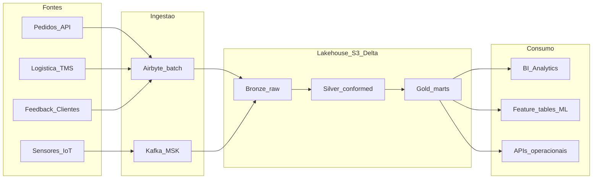

# Proposta de solucao: plataforma de dados da LogiStream Solutions

Documento de referencia da proposta apresentada no projeto pratico final da pos-graduacao em Engenharia de Dados. O objetivo e descrever como integrar as fontes da empresa para previsao de demanda e otimizacao de rotas, justificando as escolhas, nomeando as ferramentas e expondo beneficios, desafios e tempo estimado de implementacao.

O repositorio que acompanha este texto materializa a proposta com contratos, codigo, Terraform e uma demo local. A avaliacao do curso pede a descricao da solucao. O codigo e complementar.

## 1. Contexto e objetivo

A LogiStream Solutions e uma empresa de varejo online que precisa melhorar a eficiencia das entregas e reduzir custo operacional. Hoje ela coleta pedidos, dados logisticos, feedback de clientes e telemetria de armazens e veiculos. Esses dados existem, mas nao formam uma base unica o suficiente para prever demanda e otimizar rotas.

O problema de negocio, em uma frase: integrar fontes com volume e velocidade diferentes, sem perder qualidade, para alimentar dois produtos analiticos que a empresa ja pretende operar (previsao de demanda e otimizacao de rotas) sobre a infraestrutura que ela ja possui (plataforma em nuvem, BI, machine learning e APIs).

Nao faz parte desta proposta treinar o modelo de previsao nem escrever o solver de rotas. A empresa declara que ja tem sistemas de machine learning e ferramentas de BI. A engenharia de dados entrega a materia prima: dados conformados, pontuais, auditaveis e com contrato.

## 2. Leitura do problema

O briefing descreve quatro familias de dados:

1. Pedidos: produto, quantidade, local de entrega e tempo de processamento.
2. Logistica: rotas, custo de transporte e prazo.
3. Feedback: comentarios e avaliacoes de produto e de experiencia de entrega.
4. Sensores: temperatura, umidade e GPS em armazens e na frota, em tempo real.

Tambem descreve a infraestrutura ja disponivel:

- Plataforma de dados em nuvem, com armazenamento elastico e processamento em tempo real.
- Ferramentas de BI e analytics.
- Sistemas de machine learning para modelagem preditiva.
- APIs para integracao entre sistemas.

Duas tensoes atravessam o cenario. A primeira e de velocidade: pedido e feedback toleram lote; GPS e sensor de camara fria nao. A segunda e de uso: previsao de demanda olha historia agregada por produto, canal e territorio; otimizacao de rota olha estado recente da frota, janela de entrega e restricao do veiculo. Uma arquitetura so de lote atende a primeira e falha na segunda. Uma arquitetura so de streaming atende a segunda e encarece a primeira.

A leitura correta, portanto, nao e "construir um data warehouse" nem "construir um cluster de streaming". E construir uma plataforma que aceite os dois ritmos e publique dois contratos de saida, um para cada produto analitico.

## 3. Informacao que o briefing nao traz

O enunciado omite, de proposito, o que um engenheiro encontraria no primeiro mes de um projeto real. Sem essas respostas nao se dimensiona cluster, janela de SLA nem custo. A proposta segue com premissas explicitas, para ser contestavel, e lista o que precisa ser validado com as areas de negocio antes de qualquer compra de capacidade.

Perguntas em aberto:

- Qual o pais, a malha de centros de distribuicao e o recorte geografico das entregas?
- Quantos pedidos por dia, no pico e na media? Qual a sazonalidade?
- Quantos veiculos, motoristas e rotas ativas existem hoje?
- Qual o sistema de origem de cada fonte (ERP, e-commerce, TMS, CRM, IoT) e qual API ja existe?
- Qual a frequencia real dos sensores e o volume em bytes por hora?
- Qual o SLA de entrega prometido ao cliente final?
- Quem e o dono de cada dado, e quais campos sao pessoais?
- O modelo de ML ja tem contrato de features ou a plataforma precisa propo-lo?

Enquanto essas respostas nao chegam, a arquitetura precisa ser elastica o bastante para corrigir ordem de grandeza sem trocar o desenho.

## 4. Premissas de trabalho

Premissas adotadas para dimensionar a solucao. Todas devem ser revistas com operacao, logistica, produto e juridico.

- Operacao no Brasil, com oito centros de distribuicao (Sao Paulo, Campinas, Rio de Janeiro, Belo Horizonte, Curitiba, Porto Alegre, Salvador e Recife) e entregas em todo o territorio nacional.
- Volume de referencia: cerca de 50 mil pedidos por dia, com pico de 2,5 vezes essa media em datas promocionais.
- Frota de referencia: cerca de 200 veiculos em operacao simultanea.
- Pedidos e eventos do TMS chegam por API em lotes de 15 minutos.
- Feedback de clientes chega uma vez ao dia, a partir do canal de avaliacao pos-entrega.
- GPS da frota emite posicao a cada 30 segundos. Temperatura e umidade de baú e de camara fria emitem a cada 60 segundos.
- Endereco de entrega, contato do cliente e texto livre da avaliacao sao dados pessoais.
- Os times de BI e de ML ja existem. A plataforma publica marts e tabelas de features. Nao substitui essas equipes.
- A nuvem de producao e AWS, com Databricks como motor do lakehouse. Azure permanece documentada como alternativa.

Esses numeros cabem em um lakehouse Databricks de porte medio, com Kafka (Amazon MSK) so na via de sensores. Se a frota for dez vezes maior, o desenho se mantem e a conta de particionamento e de autoscaling muda. Se a frota for dez vezes menor, Kafka ainda se justifica pela natureza do dado, nao pelo volume.

## 5. Proposta de solucao

A proposta e uma plataforma de dados em lakehouse, com arquitetura medalhao (Bronze, Silver, Gold), ingestao hibrida e dois marts dimensionais no Gold.

Fluxo:

1. Pedidos, logistica e feedback entram em lote via Airbyte, lendo as APIs ja existentes, e pousam no Bronze em S3 no formato original.
2. Sensores entram em streaming via Apache Kafka (Amazon MSK). O Spark Structured Streaming grava o Bronze com baixa latencia.
3. PySpark (batch e streaming) no Databricks limpa, deduplica e conforma o Silver. Dados pessoais sao tokenizados nessa fronteira.
4. dbt, sobre Spark SQL / Databricks, publica o Gold: modelo dimensional Kimball, testes de qualidade e tabelas de features.
5. BI consome os marts. Os sistemas de ML consomem as feature tables. APIs operacionais leem visoes Gold quando a rota precisa de estado quase atual.

O desenho respeita o que a empresa ja tem. Nao se pede uma nuvem nova, um BI novo nem um laboratorio de ML novo. Pede-se um contrato de dados entre esses sistemas.

Detalhe da modelagem, das decisoes e da governanca esta em `docs/modelo-dimensional.md`, `docs/adr/` e `docs/governanca.md`.

## 6. Justificativa

O briefing pede integracao para dois usos, com volume e velocidade variaveis. Um warehouse classico, alimentado so por lote, resolve demanda e perde a posicao da frota. Um barramento so de eventos resolve a frota e transforma pedido historico em um problema caro. O lakehouse medalhao e o ponto medio: o mesmo armazenamento (S3 + Delta) aceita JSON bruto, tabela conformada e fato analitico, com ACID, evolucao de schema e governanca no catalogo.

Airbyte entra onde ja existe API e o atraso de minutos e aceitavel. Kafka entra onde o atraso de minutos torna a rota obsoleta. PySpark entra porque o curso e a infraestrutura ja apontam para processamento distribuido em batch e em stream. dbt entra porque o Gold precisa de SQL versionado, teste e linhagem, nao de notebooks irreprodutiveis. Terraform entra porque a plataforma de producao precisa ser reconstruivel, com IAM, rede e catalogo definidos como codigo.

Databricks e a escolha de motor porque cobre Unity Catalog, Delta, jobs, SQL warehouse e feature store no mesmo workspace, sobre a conta AWS da empresa. Isso reduz a quantidade de produtos que o time precisa operar no primeiro ano.

## 7. Arquitetura de referencia

Camadas:

- **Bronze.** Persistencia fiel a origem. Particionado por data de ingestao e sistema. Nenhuma regra de negocio. Serve para reprocessar.
- **Silver.** Entidades de negocio (pedido, entrega, veiculo, leitura de sensor, avaliacao) com tipos, chaves naturais, deduplicacao e PII tratado.
- **Gold.** Marts dimensionais e feature tables. E a unica camada que BI e ML enxergam.

Producao corre na AWS: VPC propria, buckets S3 por camada, KMS, IAM de menor privilegio, MSK e workspace Databricks com Unity Catalog. O repositorio descreve isso em Terraform. A demo local substitui S3 por MinIO, MSK por Kafka em Docker e o warehouse Gold por PostgreSQL, para nao depender de conta paga.

## 8. Ingestao

Tres fontes batch, uma fonte streaming. A divisao nao e dogma. E o menor desenho que respeita a velocidade de cada dado.

**Airbyte (lote).** Conectores das APIs de pedidos, TMS e feedback para S3/Delta no Bronze. Frequencia: 15 minutos para pedidos e TMS, diária para feedback. Airbyte e a peca certa quando o sistema de origem ja expoe API ou banco e o time nao quer manter um coletor por fonte. As conexoes versionadas ficam em `ingest/airbyte/`.

**Kafka (stream).** Topicos `sensors.fleet.gps`, `sensors.fleet.environment` e `sensors.warehouse.environment`. Retencao curta no cluster (24 a 72 horas). Persistencia longa e o Bronze. O produtor dos veiculos e dos CDs publica JSON com o contrato de `data/contracts/`. Spark Structured Streaming faz o sink.

**Loader local.** Airbyte OSS e pesado para notebook. A demo usa `ingest/local/` com os mesmos contratos, gravando Bronze no MinIO. Em producao, esse loader nao existe.

## 9. Processamento e transformacao

Jobs PySpark no Databricks:

- Batch horario no Bronze de pedidos, TMS e feedback, promovendo Silver.
- Streaming continuo dos topicos de sensor, com watermark de 2 minutos e janela de 1 minuto para leituras ambientais, e ponto a ponto para GPS.
- Reprocessamento pontual por particao de data, porque o Bronze e imutavel o bastante para isso.

dbt no Gold:

- Staging le Silver.
- Intermediarios constroem chaves surrogate e SCD tipo 2 onde o historico importa (produto, rota, veiculo).
- Marts publicam fatos e dimensoes conformadas.
- Testes de unicidade, preenchimento, relacionamento e faixas (temperatura, prazo, quantidade).

SQL e a linguagem do contrato analitico. Spark e a linguagem do volume. Cada um no seu lugar.

## 10. Modelagem dimensional

Dois marts, dimensoes conformadas. O detalhe esta em `docs/modelo-dimensional.md`.

Mart de demanda:

- `fato_pedido` (grao: item de pedido)
- `dim_data`, `dim_produto`, `dim_localidade`, `dim_canal`, `dim_cliente_tokenizado`

Mart de rotas:

- `fato_entrega` (grao: entrega)
- `fato_leitura_sensor` (grao: leitura agregada por minuto e dispositivo)
- `dim_veiculo`, `dim_rota`, `dim_cd`, reuso de `dim_data` e `dim_localidade`

Feature tables, ainda no Gold:

- `feat_demanda_diaria_sku_cd`: quantidade, ticket, cancelamentos, sazonalidade recente.
- `feat_rota_veiculo`: tempo medio entre pontos, ocupacao, desvio de prazo, temperatura fora de faixa.

O modelo de ML consome essas tabelas. O solver de rotas consome estado recente de `fato_entrega` e GPS consolidado. O BI consome os fatos.

## 11. Ferramentas e plataformas

Producao:

| Papel | Ferramenta | Motivo |
| --- | --- | --- |
| Nuvem e objeto | AWS (S3, IAM, VPC, KMS) | Infraestrutura declarada no briefing, com objeto barato para o lake |
| Streaming | Amazon MSK (Apache Kafka) | Padrao de mercado para IoT e replay de eventos |
| Lakehouse | Databricks (Delta, Unity Catalog, Jobs, SQL Warehouse) | Batch, stream, catalogo e governanca no mesmo workspace |
| Ingestao batch | Airbyte | Conectores de API sem coletor artesanal por fonte |
| Transformacao analitica | dbt | SQL versionado, teste e linhagem no Gold |
| Processamento | PySpark | Volume, janela e qualidade sobre Delta |
| IaC | Terraform | Rede, identidade, lake e workspace reconstruiveis |
| BI e ML | Ferramentas ja existentes na empresa | Nao duplicar o que o briefing declara pronto |

Local (demo deste repositorio): Docker Compose com Kafka, MinIO, PostgreSQL e Spark. dbt aponta para PostgreSQL. O Terraform nao precisa ser aplicado.

## 12. Estimativa de tempo

Estimativa para um time de tres engenheiros de dados e um analista, com Databricks e AWS ja contratados, sem contar o treino dos modelos de ML. Valores em semanas corridas, com folga de descoberta.

| Fase | Semanas | Resultado |
| --- | --- | --- |
| Descoberta, contratos e PII | 3 a 4 | Inventario fechado, ADRs, classificacao de dados pessoais |
| Landing zone Terraform | 4 a 6 | VPC, S3, IAM, MSK, workspace, catalogo |
| Ingestao batch Airbyte | 4 a 6 | Pedidos, TMS e feedback no Bronze |
| Streaming de sensores | 4 a 5 | Topicos, sink Spark, Bronze de IoT |
| Silver PySpark | 4 a 6 | Entidades conformadas e PII tratado |
| Gold dbt e testes | 5 a 7 | Marts de demanda e rotas, feature tables |
| Entrega BI, ML e operacao | 3 a 4 | Acessos, SLA de atualizacao, runbooks |
| Endurecimento | 3 a 4 | Observabilidade, custo, disaster recovery |

Somatorio: cerca de 30 a 42 semanas para a plataforma completa. Um MVP util (pedidos + TMS no Gold de demanda, GPS no Gold de rotas, um mart cada) cabe em 14 a 18 semanas. Datas promocionais e integracao com juridico sao as folgas que mais estouram, nao o Spark.

## 13. Beneficios

- Uma base unica para os dois produtos analiticos, com dimensoes conformadas, em vez de extracoes paralelas no ERP e no TMS.
- Reprocessamento barato: o Bronze guarda a origem, o Gold se reconstrói.
- Latencia adequada a cada uso: minutos para demanda, segundos a poucos minutos para posicao da frota.
- Governanca no catalogo (Unity Catalog) em vez de planilha de acessos.
- Custo previsivel: objeto S3 para historia, cluster Databricks elastico para processamento, MSK so na via que precisa de stream.
- Entrega alinhada ao que a empresa ja opera (BI, ML, APIs), reduzindo sombra de ferramentas.

## 14. Desafios

- Contratos das APIs de origem nao foram fornecidos. A primeira fase e negociar schema, nao desenhar cluster.
- Texto livre de feedback exige politica de PII mais rigida do que um fato de pedido.
- GPS a cada 30 segundos em 200 veiculos e tratavel. Sem particionamento por `vehicle_id` e watermark, o job de stream vira conta surpresa.
- SCD tipo 2 em produto e rota exige disciplina de chave. Sem isso, a previsao de demanda mistura o SKU antigo com o novo.
- Databricks e MSK tem custo de ociosidade. Jobs job-cluster e autoscaling do MSK precisam de dono.
- O time de ML pode pedir features que o Gold ainda nao tem. O contrato das feature tables precisa de versao, como qualquer API.

## 15. Alternativas consideradas

**Warehouse classico em lote unico.** Mais simples, mais barato no primeiro trimestre. Descarta a velocidade dos sensores e torna a otimizacao de rota um relatorio do dia anterior. Rejeitada como arquitetura alvo. Aceita como etapa do MVP (primeiro o mart de demanda).

**Kappa (tudo via Kafka).** Simetria operacional elegante. Pedido e feedback nao precisam disso e o custo de Kafka + schema registry para lote diario nao se paga. Rejeitada.

**Azure (ADLS, Event Hubs, Azure Databricks).** Equivalente funcional. Nao foi a escolha primaria porque o Terraform deste repositorio e a referencia de producao apontam AWS. A alternativa permanece valida se a empresa ja tiver contrato Microsoft. Ver `docs/adr/0003-aws-versus-azure.md`.

**Data mesh imediato.** A empresa ainda nao tem dominio de dados maduro nem plataforma compartilhada. Mesh agora espalharia o problema. O lakehouse central e o passo certo. Mesh pode aparecer depois, com os marts de demanda e rotas como primeiros produtos de dados.

## 16. Riscos e proximos passos com o negocio

Riscos principais: schema de origem instavel, atraso juridico em PII, subdimensionamento do MSK em pico promocional, e Gold que nao atende o contrato do modelo de ML.

Proximos passos, nesta ordem, antes de provisionar capacidade:

1. Fechar inventario de sistemas e donos com operacao, logistica e atendimento.
2. Classificar campos pessoais com o juridico.
3. Confirmar volume real de pedidos e de sensores em uma semana tipica e em uma semana de pico.
4. Assinar o contrato das feature tables com o time de ML.
5. Assinar o contrato dos marts com o time de BI.
6. So entao aplicar o Terraform da landing zone.

Enquanto isso, este repositorio ja expoe os contratos, o gerador sintetico, os jobs e o modelo dimensional para a conversa com essas areas.
